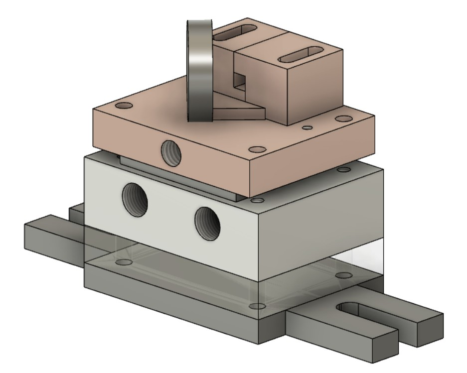

# LASER4DIY Laser Source

This is the repository is part of the [Laser4DIY project](http://www.laser4diy.org/).

## Description 

This repository contains the CAD files for the machined metal parts needed to build the LASER4DIY laser source.

Please note that this documentation is distributed without any express or implied warranty. Use it at your own risk. Please also read the details of the CERN-OHL license.

## Configuration

The parts can be arranged for two setups: the microchip configuation used in LASER4DIY, and the amplifier configuration, with is an optional addon for LASER4DIY. The following parts are stacked for the two configurations (from bottom to top):

Config Microchip (MC):
* 1x baseplate (Al)
* 1x plexi spacer (PMMA)
* 1x cooler (Al)
* 1x Peltier element
* 1x MC-heatspreader (Cu)
* 1x MC-bracket-A (Cu)
* 1x MC-bracket-B (Cu)
* 1x MC-lensbar (Al)  

Config Amplifier (AMP):
* 1x baseplate (Al)
* 1x plexi spacer (PMMA)
* 1x cooler (Al)
* 1x Peltier element
* 1x AMP-heatspreader (Cu)
* 1x AMP-bracket-A (Cu)
* 1x AMP-bracket-B (Cu)

This is what the amplifier configuration looks like:

## License

This hardware documentation is licensed under CERN-OHL-P v2.

---

Copyright FabLab München e.V. 2022.

Laser4DIY is sponsored by the Federal Ministry of Education and Research

This source describes Open Hardware and is licensed under the CERN-OHL-P v2

You may redistribute and modify this documentation and make products using it 
under the terms of the CERN-OHL-P v2 (https:/cern.ch/cern-ohl).
This documentation is distributed WITHOUT ANY EXPRESS OR IMPLIED WARRANTY, 
INCLUDING OF MERCHANTABILITY, SATISFACTORY QUALITY AND FITNESS FOR A  PARTICULAR 
PURPOSE. Please see the CERN-OHL-P v2 for applicable conditions

